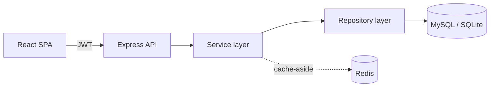

# Store Rating Platform

A full-stack web application where users rate registered stores from **1 to 5**.
It supports three roles — **System Administrator**, **Normal User**, and
**Store Owner** — behind a single JWT login, with a dark, SaaS-style dashboard
and a layered REST API.

<p align="left">
  
  
  
  
  
  
  
</p>

---

## Table of Contents

- [Tech Stack](#tech-stack)
- [Features](#features)
- [Architecture](#architecture)
- [Database Schema](#database-schema)
- [Project Structure](#project-structure)
- [Getting Started](#getting-started)
- [Demo Accounts](#demo-accounts)
- [Environment Variables](#environment-variables)
- [API Reference](#api-reference)
- [Testing](#testing)
- [Deployment](#deployment)
- [License](#license)

---

## Tech Stack

**Backend** — Node.js · Express · Sequelize · MySQL (SQLite fallback) · Redis ·
JWT · Joi · Winston · Swagger

**Frontend** — React 19 · Vite · Tailwind CSS · TanStack Query · React Hook Form ·
Zod · Recharts · Framer Motion · Sonner

**Infra** — Docker · Docker Compose · Nginx · Jest

---

## Features

### System Administrator
- Dashboard with total users, stores and ratings
- Ratings-growth chart, users-by-role chart, and a recent-activity feed
- Create users of any role and register stores
- Search, filter, sort and paginate users and stores
- CSV export

### Normal User
- Self sign-up and login
- Browse and search stores by name or address
- Submit and update a 1–5 rating per store
- See each store's overall average and your own rating

### Store Owner
- Dashboard with the store's average rating, total ratings and unique raters
- Paginated list of users who rated the store
- CSV export of ratings

### Shared
- JWT auth with **refresh-token rotation**, bcrypt password hashing, and
  **role-based access control**
- Change password (which revokes all active sessions)
- Redis cache-aside, rate limiting, security headers, request logging
- Swagger API documentation

---

## Architecture

The backend follows a layered request flow so each concern lives in one place:

```
Request
  → Route          define the endpoint + which middleware runs
  → Middleware     JWT auth · RBAC · Joi validation · rate limit
  → Controller     read the request, call a service, send the response
  → Service        business logic · caching · activity logging
  → Repository     all database access via Sequelize
  → Database       MySQL / SQLite
```



**Caching (cache-aside).** Reads check Redis first; on a miss the value is loaded
from the database and stored back. Writes invalidate the affected keys.

```
Service → Redis (hit? return) → miss → Repository → DB → store in Redis → return
```

---

## Database Schema

```
users                       stores                      ratings
─────────                   ─────────                   ─────────
id            PK            id            PK            id            PK
name                        name                        rating        (1..5)
email     UNIQUE            email     UNIQUE            user_id   FK → users.id
password (bcrypt)           address                     store_id  FK → stores.id
address                     owner_id  FK → users.id     created_at
role (ENUM)                 created_at                  updated_at
created_at                  updated_at                  UNIQUE(user_id, store_id)
updated_at
```

Supporting tables: `activity_logs` (audit feed) and `refresh_tokens` (hashed,
rotating, revocable).

**Relationships**
- A user has many ratings; a store has many ratings.
- A store owner (user) owns one store.
- A user can rate a store only once — enforced by a unique index on
  `(user_id, store_id)`. Re-submitting returns `409`, which the client turns
  into an update.

**Indexes:** `users.email`, `users.role`, `stores.name`, `stores.owner_id`,
`ratings.store_id`, `ratings.user_id`, and the unique `(user_id, store_id)` pair.

---

## Project Structure

```
store-rating-app/
├── backend/
│   └── src/
│       ├── config         env, logger, database, redis, swagger
│       ├── controllers    thin request/response handlers
│       ├── services       business logic + caching
│       ├── repositories   data access (Sequelize)
│       ├── routes         endpoint definitions (+ swagger docs)
│       ├── middlewares    auth, rbac, validation, error, rate limit
│       ├── models         User, Store, Rating, ActivityLog, RefreshToken
│       ├── validations    Joi schemas
│       ├── utils          ApiError, ApiResponse, jwt, password, pagination, csv
│       ├── database       connection + sync
│       └── seed           seed script
├── frontend/
│   └── src/
│       ├── components      reusable UI + charts
│       ├── layouts         dashboard shell, sidebar, topbar, auth layout
│       ├── pages           auth, admin, user, owner pages
│       ├── routes          protected + role-based routing
│       ├── services        axios instance + per-resource API calls
│       ├── hooks           debounce, download
│       ├── contexts        auth context
│       ├── validations     zod schemas
│       ├── constants       roles, routes
│       └── utils           formatting, class helper
├── docker-compose.yml
└── README.md
```

---

## Getting Started

### Prerequisites

- Node.js 18+ and npm
- (Optional) Docker + Docker Compose for the full MySQL + Redis stack

### Option A — Docker (MySQL + Redis + API + Web)

```bash
docker compose up --build
```

| Service | URL                              |
|---------|----------------------------------|
| Web     | http://localhost:8080            |
| API     | http://localhost:5000/api        |
| Docs    | http://localhost:5000/api/docs   |

The backend seeds the database on startup.

### Option B — Run locally (no database server required)

The backend defaults to **SQLite** and runs **without Redis**, so it works with
zero setup.

**Backend**
```bash
cd backend
cp .env.example .env
npm install
npm run seed      # creates the admin + demo data
npm run dev       # http://localhost:5000
```

**Frontend**
```bash
cd frontend
npm install
npm run dev       # http://localhost:5173
```

---

## Demo Accounts

| Role         | Name                         | Email                    | Password   |
|--------------|------------------------------|--------------------------|------------|
| Administrator| Rajesh Kumar Choudhary       | admin@storerating.com    | Admin@1234 |
| Store Owner  | Ananya Subramaniam Iyer      | owner1@storerating.com   | Owner@123  |
| Normal User  | Aarav Kumar Sharma Gupta     | aarav@example.com        | User@1234  |

> Passwords are case-sensitive. Type them manually rather than pasting.

---

## Environment Variables

See [`backend/.env.example`](backend/.env.example) for the full list.

| Variable             | Default          | Purpose                                   |
|----------------------|------------------|-------------------------------------------|
| `DB_DIALECT`         | `sqlite`         | `sqlite` (zero-config) or `mysql`         |
| `REDIS_ENABLED`      | `false`          | turn caching on/off                       |
| `JWT_ACCESS_SECRET`  | —                | access-token signing secret               |
| `JWT_REFRESH_SECRET` | —                | refresh-token signing secret              |
| `COOKIE_SECURE`      | `false`          | set `true` only when served over HTTPS    |
| `SEED_DEMO`          | `false`          | seed demo data even in production         |
| `CORS_ORIGIN`        | `localhost:5173` | allowed frontend origin(s)                |

---

## API Reference

Interactive docs (Swagger UI): **http://localhost:5000/api/docs**

| Method     | Endpoint                       | Role         |
|------------|--------------------------------|--------------|
| POST       | `/api/auth/register`           | public       |
| POST       | `/api/auth/login`              | public       |
| POST       | `/api/auth/refresh`            | public       |
| POST       | `/api/auth/logout`             | any          |
| GET        | `/api/auth/me`                 | any          |
| PUT        | `/api/auth/password`           | any          |
| GET        | `/api/admin/dashboard`         | admin        |
| GET / POST | `/api/admin/users`             | admin        |
| GET        | `/api/admin/users/:id`         | admin        |
| GET        | `/api/admin/users/export`      | admin        |
| GET / POST | `/api/admin/stores`            | admin        |
| GET        | `/api/admin/stores/export`     | admin        |
| GET        | `/api/stores`                  | normal user  |
| POST / PUT | `/api/stores/:storeId/rating`  | normal user  |
| GET        | `/api/owner/dashboard`         | store owner  |
| GET        | `/api/owner/raters`            | store owner  |
| GET        | `/api/owner/raters/export`     | store owner  |

---

## Testing

```bash
cd backend
npm test
```

Jest unit tests cover the auth and rating services (registration, duplicate
handling, login, password change, refresh-token rotation, rating
submit/update/conflict) against an in-memory SQLite database.

---

## Deployment

1. Provision MySQL and Redis.
2. Build and run the backend image (`backend/Dockerfile`) with production env:
   `DB_DIALECT=mysql`, the `DB_*` values, `REDIS_ENABLED=true`, strong `JWT_*`
   secrets, `COOKIE_SECURE=true` (behind HTTPS), and `CORS_ORIGIN` set to your
   web origin.
3. Build the frontend image (`frontend/Dockerfile`); Nginx serves the static
   build and proxies `/api` to the backend.
4. `docker compose up --build` runs all four services together and is a working
   reference for a single-host deployment.

---

## License

Released under the MIT License.
